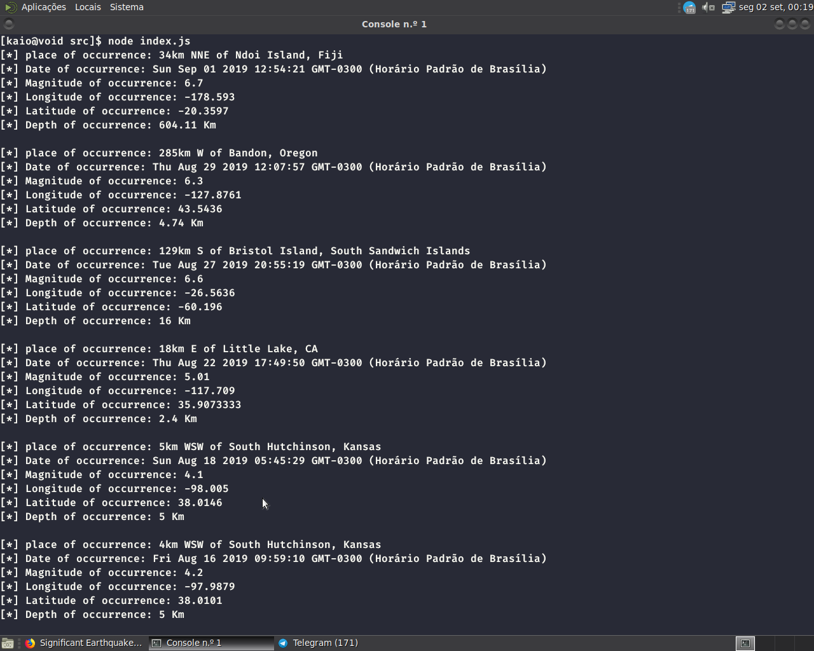

# recent-earthquakes

## This a  NodeJS, CLI based application, that displays a list of recent Earthquakes


### Setup instructions:

##### Clone the repository to your computer:

```
$ git clone https://github.com/RIS33/recent-earthquakes
```

#### Change to the application directory 

```
$ cd recent-earthquakes
```

##### Install the required dependencies using yarn or npm

```
$ yarn
```

or

```
$ npm install
```

#### Start the applicaiton

```
$ yarn start
```

or

```
$ npm start
```

###### You can contact me via telegram: https://t.me/KaioZZZZZz
